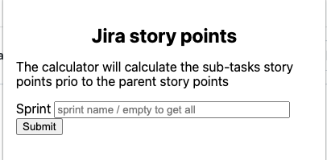
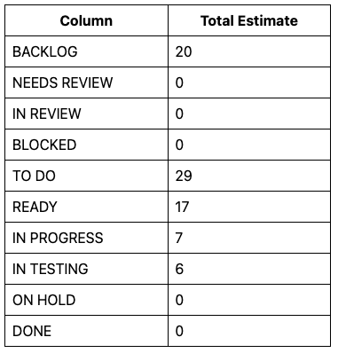
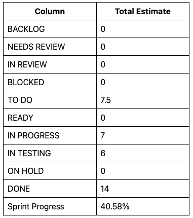
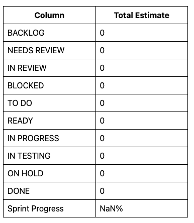

# jira-chrome-extension
This is a chrome browser extension. It will display the total number of the story points of each Jira ticket status.

## How to install
To install this extension to chrome, please clone the git project to your local machine.
And follow [Load an unpacked extension](https://developer.chrome.com/docs/extensions/mv3/getstarted/#unpacked) to install it to chrome.

## How to use it

The extension will call Jira Rest API to collect all the sub-tasks and the stories without sub-tasks (max 1000 tickets). 
It will loop through each ticket and calculate the total number of the story points of each Jira ticket status.

### Mandatory Fields
Please update following values in the **popup.js** file to match your team. 

```aidl
// line 1 to 3
const jiraUser = `{username}:{password}`;
const area='"Engage Platform"';
const team='"Engage Platform - Odyssey"';
```

### Use the extension


By default, if there is no sprint name provide, after submit, the extension will get all the jira ticket based on your configuration.



Otherwise, provide a sprint name and the extension will calculate all the tickets from the sprint only. And it will also provide a sprint process value (Done/Total story points).



If you provide an unknown sprint name, then you will not get any calculations.



### How to debug
If there is an issue with Jira Rest API request, the extension will report an error. You can use developer inspect to see console log.


If you have any quesitons feel free to ping Chen Li